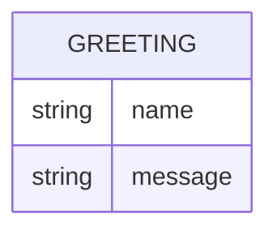

# Domain model

Greeting Board has a single, in-memory concept: the greeting a visitor builds
by typing a name. Nothing here is persisted — it lives only in the browser
while the page is open, and is lost on refresh.

- `name` is exactly what the visitor typed.
- `message` is the displayed greeting, built from `name` (e.g. "Hello, Ana!").